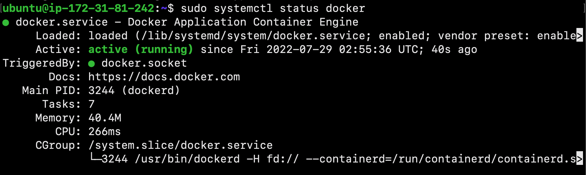

## **_Project11-NodeJS-app-Docker_**
------------------------------------------------------------
### Overview

Hello and welcome! My name is Cecilia, and in this amazing project, I will create an application image for a static website that uses the Express and Bootstrap frameworks. I will then build a container using that image and push it to Docker Hub for future use. Finally, I will pull the stored image from my Docker Hub repository and build another container, demonstrating how to recreate and scale an application.

--------------------------------------------------------------------------
### Getting Started

In this section, we will spin up an Ubuntu instance and then install the following tools: 
- Docker
- Node.js and npm

First, begin by spinning up an Ubuntu instance using the AWS Management Console. 


After the instance has reached a running state, use the downloaded key pair to securely connect to the remote server.


##### Installing Docker

To install Docker, first we must update the existing list of packages using the following command:

```
$ sudo apt update
```

Next, we will install a few prerequisite packages. This apt command will allow the use of packages over HTTPS:

```
$ sudo apt install apt-transport-https ca-certificates curl software-properties-common
```

Next, add the GPG key for the official Docker repository to your system:

```
$ curl -fsSL https://download.docker.com/linux/ubuntu/gpg | sudo apt-key add -
```

Then, add the Docker repository to APT sources:

```
$ sudo add-apt-repository "deb [arch=amd64] https://download.docker.com/linux/ubuntu bionic stable"
```

Next, update the package database with the Docker packages from the newly added repo:

```
$ sudo apt update
```

Ensure you are about to install from the Docker repository instead of the default Ubuntu repo:

```
$ apt-cache policy docker-ce
```


Finally, install Docker:

```
$ sudo apt install docker-ce
```

Docker should now be installed, the daemon started, and the process enabled to start on boot! 

Check that it is running:

```
$ sudo systemctl status docker
```



##### Installing Node.js & npm

Next, we will install Node.js and npm using the PPA (personal package archive) maintained by [NodeSource](https://github.com/nodesource/distributions/blob/master/README.md). From your home directory, use the following curl command to retrieve the installation:

```
$ cd ~
$ curl -fsSL https://deb.nodesource.com/setup_current.x | sudo -E bash - sudo apt-get install -y nodejs
```


Verify you’ve installed the new version by running node with the -v flag:

```
$ node -v
```

This nodejs package contains both node and npm, so you don’t need to install npm separately.

Run the following command to verify that npm is installed and to create the configuration file:

```
$ npm -v
```


In order for some npm packages to work (those that require compiling code from source, for example), you need to install the build-essential package.

```
$ sudo apt install build-essential
```


Great job! Now you have the necessary tools to work with npm packages that require compiling code from source.
##### Creating a Docker Hub account

Lastly, we must set up a Docker Hub account. Visit the Docker Hub website at https://hub.docker.com. Then, click `Register` and follow the on-screen instructions to create an account.


--------------------------------------------------------------------------
### PART #1: Installing Application Dependencies

In order to create an image, first we will make the application files and then copy them to the container.

Begin by creating a root directory for this project named `node_project`:

```
$ mkdir node_project
```

Next, navigate to this directory:

```
$ cd node_project
```

Next, create a [`package.json`](https://docs.npmjs.com/files/package.json) file with your project's dependencies and other identifying information. Open the file with `nano` or your favorite editor:

```
$ nano package.json
```

Add the following information about the project. Be sure to replace the author information with your own name and contact details:

```
{
  "name": "nodejs-image-demo",
  "version": "1.0.0",
  "description": "nodejs image demo",
  "author": "Your Name <Email@example.com>",
  "license": "MIT",
  "main": "app.js",
  "keywords": [
    "nodejs",
    "bootstrap",
    "express"
  ],
  "dependencies": {
    "express": "^4.16.4"
  }
}

```


Save and close the file by typing `CTRL + X`. Press `Y` and then `ENTER` to confirm your changes.

Next, to install your project's dependencies, run the following command:

```
$ npm install
```


--------------------------------------------------------------------------

### PART #2: Creating the Application Files

In this section, we will create a website that offers users information about sharks.

First, open `app.js` in the main project directory to define the project's routes:

```
$ nano app.js
```

Add the following lines of code:

```
const express = require('express');
const app = express();
const router = express.Router();

const path = __dirname + '/views/';
const port = 8080;

router.use(function (req,res,next) {
  console.log('/' + req.method);
  next();
});

router.get('/', function(req,res){
  res.sendFile(path + 'index.html');
});

router.get('/sharks', function(req,res){
  res.sendFile(path + 'sharks.html');
});

app.use(express.static(path));
app.use('/', router);

app.listen(port, function () {
  console.log('Example app listening on port 8080!')
})

```


Save and close the file when you are finished.

Next, add some static content to the application. Start by creating the `views` directory:

```
$ mkdir views
```

Open the landing page file, `index.html`:

```
$ nano index.html
```

Add the following code to the file, which will import Boostrap and create a [jumbotron](https://getbootstrap.com/docs/4.0/components/jumbotron/) component with a link to the more detailed `sharks.html` info page:

```
<!DOCTYPE html>
<html lang="en">

<head>
    <title>About Sharks</title>
    <meta charset="utf-8">
    <meta name="viewport" content="width=device-width, initial-scale=1">
    <link rel="stylesheet" href="https://stackpath.bootstrapcdn.com/bootstrap/4.1.3/css/bootstrap.min.css" integrity="sha384-MCw98/SFnGE8fJT3GXwEOngsV7Zt27NXFoaoApmYm81iuXoPkFOJwJ8ERdknLPMO" crossorigin="anonymous">
    <link href="css/styles.css" rel="stylesheet">
    <link href="https://fonts.googleapis.com/css?family=Merriweather:400,700" rel="stylesheet" type="text/css">
</head>

<body>
    <nav class="navbar navbar-dark bg-dark navbar-static-top navbar-expand-md">
        <div class="container">
            <button type="button" class="navbar-toggler collapsed" data-toggle="collapse" data-target="#bs-example-navbar-collapse-1" aria-expanded="false"> <span class="sr-only">Toggle navigation</span>
            </button> <a class="navbar-brand" href="#">Everything Sharks</a>
            <div class="collapse navbar-collapse" id="bs-example-navbar-collapse-1">
                <ul class="nav navbar-nav mr-auto">
                    <li class="active nav-item"><a href="/" class="nav-link">Home</a>
                    </li>
                    <li class="nav-item"><a href="/sharks" class="nav-link">Sharks</a>
                    </li>
                </ul>
            </div>
        </div>
    </nav>
    <div class="jumbotron">
        <div class="container">
            <h1>Want to Learn About Sharks?</h1>
            <p>Are you ready to learn about sharks?</p>
            <br>
            <p><a class="btn btn-primary btn-lg" href="/sharks" role="button">Get Shark Info</a>
            </p>
        </div>
    </div>
    <div class="container">
        <div class="row">
            <div class="col-lg-6">
                <h3>Not all sharks are alike</h3>
                <p>Though some are dangerous, sharks generally do not attack humans. Out of the 500 species known to researchers, only 30 have been known to attack humans.
                </p>
            </div>
            <div class="col-lg-6">
                <h3>Sharks are ancient</h3>
                <p>There is evidence to suggest that sharks lived up to 400 million years ago.
                </p>
            </div>
        </div>
    </div>
</body>

</html>

```


Save and close the file when you are finished.

Now that the application landing page in place, you can create your shark information page, `sharks.html`. This will offer interested users more information about sharks.

Open the file in your text editor using the following command:

```
$ nano sharks.html
```

Next, add the following code, which imports Bootstrap, the custom style sheet, and detailed information about certain sharks:

```
<!DOCTYPE html>
<html lang="en">

<head>
    <title>About Sharks</title>
    <meta charset="utf-8">
    <meta name="viewport" content="width=device-width, initial-scale=1">
    <link rel="stylesheet" href="https://stackpath.bootstrapcdn.com/bootstrap/4.1.3/css/bootstrap.min.css" integrity="sha384-MCw98/SFnGE8fJT3GXwEOngsV7Zt27NXFoaoApmYm81iuXoPkFOJwJ8ERdknLPMO" crossorigin="anonymous">
    <link href="css/styles.css" rel="stylesheet">
    <link href="https://fonts.googleapis.com/css?family=Merriweather:400,700" rel="stylesheet" type="text/css">
</head>
<nav class="navbar navbar-dark bg-dark navbar-static-top navbar-expand-md">
    <div class="container">
        <button type="button" class="navbar-toggler collapsed" data-toggle="collapse" data-target="#bs-example-navbar-collapse-1" aria-expanded="false"> <span class="sr-only">Toggle navigation</span>
        </button> <a class="navbar-brand" href="/">Everything Sharks</a>
        <div class="collapse navbar-collapse" id="bs-example-navbar-collapse-1">
            <ul class="nav navbar-nav mr-auto">
                <li class="nav-item"><a href="/" class="nav-link">Home</a>
                </li>
                <li class="active nav-item"><a href="/sharks" class="nav-link">Sharks</a>
                </li>
            </ul>
        </div>
    </div>
</nav>
<div class="jumbotron text-center">
    <h1>Shark Info</h1>
</div>
<div class="container">
    <div class="row">
        <div class="col-lg-6">
            <p>
                <div class="caption">Some sharks are known to be dangerous to humans, though many more are not. The sawshark, for example, is not considered a threat to humans.
                </div>
                
            </p>
        </div>
        <div class="col-lg-6">
            <p>
                <div class="caption">Other sharks are known to be friendly and welcoming!</div>
                
            </p>
        </div>
    </div>
</div>

</html>

```


Save and close the file when you are finished.

Finally, we will create the custom CSS style sheet that you've linked to in `index.html` and `sharks.html`.

Create a `css` folder in the `views` directory:

```
$ mkdir views/css
```

Then, open the style sheet:

```
$ nano styles.css
```

Add the following code, which will set the desired color and font for your pages:

```
.navbar {
	margin-bottom: 0;
}

body {
	background: #020A1B;
	color: #ffffff;
	font-family: 'Merriweather', sans-serif;
}

h1,
h2 {
	font-weight: bold;
}

p {
	font-size: 16px;
	color: #ffffff;
}

.jumbotron {
	background: #0048CD;
	color: white;
	text-align: center;
}

.jumbotron p {
	color: white;
	font-size: 26px;
}

.btn-primary {
	color: #fff;
	text-color: #000000;
	border-color: white;
	margin-bottom: 5px;
}

img,
video,
audio {
	margin-top: 20px;
	max-width: 80%;
}

div.caption: {
	float: left;
	clear: both;
}

```


Save and close the file when you are finished.

With the application files in place and the project dependencies installed, you are ready to start the application!

To permit traffic to port `8080` run the following command:

```
$ sudo ufw allow 8080
```

Additionally, on the AWS console, ensure that the security group for the instance allows all traffic.


Next, start the application from the project's root directory using the following command:

```
$ node app.js
```


Navigate your browser to `http://your_server_ip:8080`. 

You should see the following landing page:


Clicking on the `Get Shark Info` button will take you to the following information page:


Nice work! You now have an application up and running. When you are ready, quit the server by typing `CTRL + C`

--------------------------------------------------------------------------

### PART #3: Writing the Dockerfile

In this section, we will create the Dockerfile that will allow you to recreate and scale this application as desired. A Dockerfile allows you to define your container environment and avoid discrepancies with dependencies or runtime versions

In your project's root directory, create the Dockerfile:

```
$ nano Dockerfile
```

Docker images are created using a succession of layered images that build on one another. The first step will be to add the *base image* for your application that will form the starting point of the application build.

Add the following code:

```
FROM node:10-alpine

RUN mkdir -p /home/node/app/node_modules && chown -R node:node /home/node/app

WORKDIR /home/node/app

COPY package*.json ./

USER node

RUN npm install

COPY --chown=node:node . .

EXPOSE 8080

CMD [ "node", "app.js" ]

```


Save and close the file when you are finished editing.

Before building the application image, add a [`.dockerignore` file](https://docs.docker.com/engine/reference/builder/#dockerignore-file).

Open the `.dockerignore` file:

```
$ nano .dockerignore
```

Inside the file, add your local node modules, npm logs, Dockerfile, and `.dockerignore` file:

```
node_modules
npm-debug.log
Dockerfile
.dockerignore
```


Save and close the file when you are finished.

Excellent work! You are now ready to build the application image using the [`docker build`](https://docs.docker.com/engine/reference/commandline/build/) command. 

Remember to also replace `your_dockerhub_username` with your own Docker Hub username:

```
$ docker build -t your_dockerhub_username/nodejs-image-demo .
```


It will take some time to build the image. Once it is complete, check your images:

```
$ docker images
```


Next, run the following command to build the container:

```
$ docker run --name nodejs-image-demo -p 80:8080 -d your_dockerhub_username/nodejs-image-demo
```


Once your container is up and running, you can inspect a list of your running containers with [`docker ps`](https://docs.docker.com/engine/reference/commandline/ps/):

```
$ docker ps
```


With your container running, you can now visit your application by navigating your browser to `http://your_server_ip`:


--------------------------------------------------------------------------
### PART #4: Using a Repository to Work with Images

Now that you have created an image for your application, you can push it to Docker Hub for future use. By pushing your application image to a registry like Docker Hub, you make it available for subsequent use as you build and scale your containers. 

To demonstrate how this works, we will push the application image to a repository and then use the image to recreate your container.

The first step to pushing the image is to log in to the Docker Hub using the following command (replace `your_dockerhub_username` with your own credentials):

```
$ docker login -u your_dockerhub_username
```

When prompted, enter your Docker Hub account password. Logging in this way will create a `~/.docker/config.json` file in your user's home directory with your Docker Hub credentials.


You can now push the application image to Docker Hub using the tag you created earlier, `your_dockerhub_username/nodejs-image-demo`:

```
$ docker push your_dockerhub_username/nodejs-image-demo
```


Next, let's test the utility of the image registry by destroying our current application container and image and rebuilding them with the image in our repository.

First, list your running containers:

```
$ docker ps
```

Using the `CONTAINER ID` listed in your output, stop the running application container. Be sure to replace the highlighted ID below with your own `CONTAINER ID`:

```
$ docker stop CONTAINER-ID
```


List your all of your images with the `-a` flag:

```
$ docker images -a
```
 
Remove the stopped container and all of the images, including unused or dangling images, with the following command:

```
$ docker system prune -a
```

Type `Y` when prompted to confirm that you would like to remove the stopped container and images.


Good job! You have now removed both the container running your application image and the image itself. 

Now that all of your images and containers deleted, you can now pull the application image from Docker Hub:

```
$ docker pull your_dockerhub_username/nodejs-image-demo
```

List your images using the following command:

```
$ docker images
```

You will see your application image:


Now, rebuild your container using the following command:

```
$ docker run --name nodejs-image-demo -p 80:8080 -d your_dockerhub_username/nodejs-image-demo
```

List your running containers:

```
$ docker ps
```


Visit `http://your_server_ip` once again to view your running application.


----------------------------------------------------------------------
### Clean Up

To avoid incurring future charges, terminate the instance on the AWS console.


----------------------------------------------------------------------

Wonderful job! Thank you for viewing my project and following along. We learned how to create a static web application with Express and Bootstrap, as well as a Docker image for this application. We used this image to create a container and pushed the image to Docker Hub. From there, we were able to destroy your image and container and recreate them using your Docker Hub repository.

I hope you enjoyed it! For more details on similar projects and more, please visit my GitHub portfolio: https://github.com/ceciliacloud


